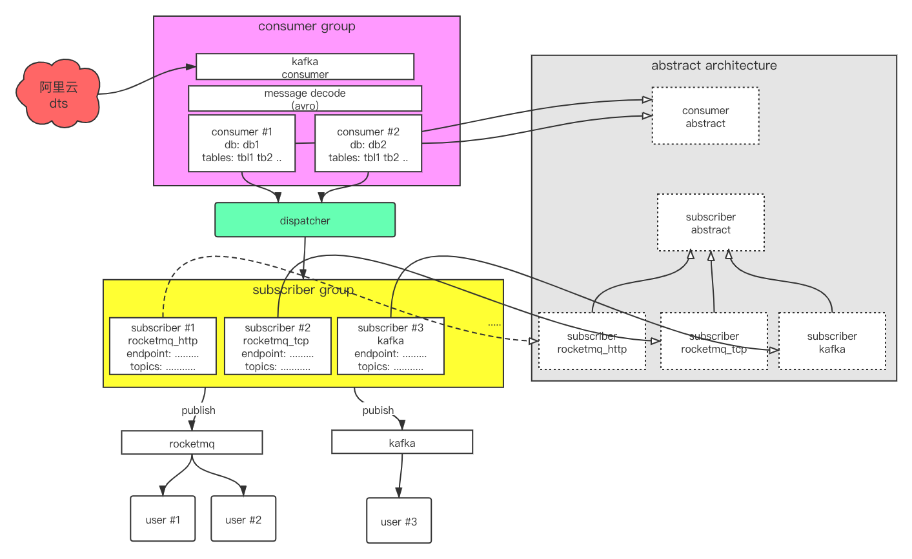

#aliyun dts dispatcher
##统一DTS订阅服务介绍 

统一DTS订阅服务设计用于高效连接阿里云DTS与用户端，采用多客户接入集中式管理，支持实时接入数据订阅。<br> 
特点：<br> 
1）屏蔽DTS配置细节，业务只需关系订阅对象 <br>
2）实时接入、下线<br> 
3）HTTP接口管理<br> 
4）支持多种订阅通道（rocketmq[tcp|http],kafka)<br> 
5）支持字段分区HASH、消费顺序<br> 
6）k8s集群部署、HA保障<br>



Subscriber: etcd config demo
```
rocketmq-http:
{"name":"test-rocketmq","consumer":"consumer-test","endpoint":"http://888.mqrest.cn-zhangjiakou.aliyuncs.com","access_key":"","secret_key":"","topic":"dts-test","instance_id":"","type":1,"tables":["table1","table2"],"force_update":true}

kafka
{"name":"test-kafka","consumer":"consumer-test","servers":["127.0.0.1:9092","127.0.0.1:9092","127.0.0.17:9092"],"topics":["dts-test"],"consumer_group":"DTS_TEST","type":3,"tables":["table1","table2"],"force_update":true}
```
```
./etcdctl --endpoints=127.0.0.1:2379 put subcfg '{"name":"consumer-test-rocketmq","consumer":"consumer-test","endpoint":"http://321.mqrest.cn-zhangjiakou.aliyuncs.com","access_key":"","secret_key":"","topic":"dts-test","instance_id":"","type":1,"tables":["table1","table2"],"force_update":true}'
etcdctl --endpoints=127.0.0.1:2379 put subcfg-test '{"name":"consumer-test-kafka","consumer":"consumer-test","servers":["127.0.0.1:9092","127.0.0.1:9092","127.0.0.1:9092"],"topics":["dts-test"],"consumer_group":"DTS_TEST","type":3,"tables":["table1","table2"],"force_update":true}'
```

etcd配置
```
etcdctl --endpoints=localhost:2379 put subcfg-sks-test
'{"name":"dts-sks","consumer":"prod","endpoint":"http://123.mqrest.cn-zhangjiakou.aliyuncs.com","access_key":"","secret_key":"","topic":"dts-topic","instance_id":"","type":1,"tables":["table1"],"force_update":true}'
```

查看etcd
```
etcdctl --endpoints=127.0.0.1:2379 get s —prefix
```

微信：185-0008-3308